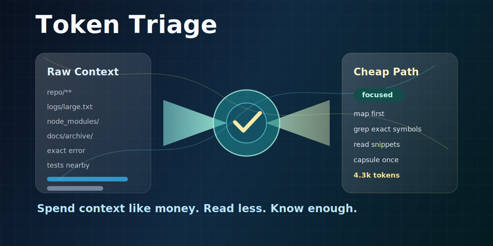

# Token Triage Plugin



Token Triage gives Claude Code a token-cost preflight skill. It helps agents map first, read less, avoid repeated context, create reusable capsules, and calculate how many tokens or dollars were saved.

## Components

- `skills/token-triage/SKILL.md` - the agent workflow.
- `skills/token-triage/scripts/estimate_context.py` - estimates context size for files, folders, or stdin.
- `skills/token-triage/scripts/calculate_savings.py` - compares baseline vs triaged token spend.
- `skills/token-triage/references/` - budget modes, read strategies, and output contracts.

## Try It

```text
Use $token-triage before reviewing this repository.
```

```text
Use $token-triage to plan this feature, but keep exploration under 5k tokens.
```

```bash
python skills/token-triage/scripts/calculate_savings.py \
  --baseline-tokens 50000 \
  --actual-tokens 12000 \
  --runs 20 \
  --input-price-per-1m 3 \
  --output-price-per-1m 15
```
